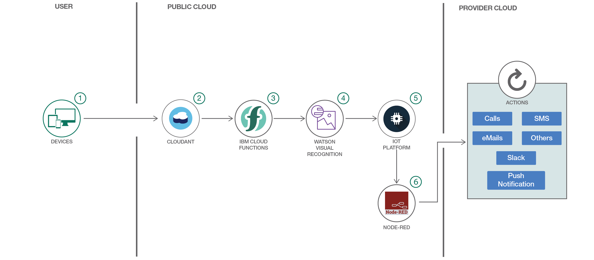

**__Skill Level__**: Any Skill Level
<br>**__N.B__**: All services used in this repo are Lite plans.



# Upload and process an image into IBM Cloud to receive alerts
Build an IoT project with IBM Cloud Functions (serverless), Node-RED, Node.js and along with IoT Platform.


## Overview and Goal
The goal of this tutorial is to take images from any other source, process it and trigger alerts to inform a change, a danger, etc. This project can be a quick setup or can be attached to an existing project to do the analysis of images and send alerts.

This tutorial will use an app to insert images into Cloudant, process it and display an alert. It is divided into multiple parts followed by a set of steps in each part to help you build an application based on visual recognition. The folders in this repo are seperate entities of applications that will need a separate setup.

The workflow is not limited to the diagram shown above only but it can be expanded. We will be showcasing how to do it and you can take on this project, expand it, change it or make a real use of it.

**Let's take an overall look on these parts:**
> * Run any application to upload an image. In this example, I provided the **viz-send-image-app** folder (STEP 1)
> * Create a Cloudant database service (STEP 2)
> * Create IBM Cloud Functions (**viz-openwhisk** folder) (STEP 3)
> * Include Watson Visual Recognition code in IBM Cloud Functions (STEP 4)
> * Create IoT Platform service where IBM Cloud Functions will process images and send them to the IoT Platform (STEP 5)
> * Create Node-RED nodes to send the any alert (STEP 6)


## Prerequisites
You will need the following accounts and tools:
* [IBM Cloud account](https://console.ng.bluemix.net/registration/)
* [Bluemix CLI](https://console.bluemix.net/docs/cli/reference/bluemix_cli/index.html#getting-started)
* [Openwhisk CLI](https://github.com/apache/incubator-openwhisk-cli/releases)
* [nodejs](https://nodejs.org/en/download/)
To verify you have nodejs installed run `node -v` at a command prompt/terminal.
* Optional: [Git](https://git-scm.com/downloads)
If you choose to use Git to download the code samples you must also have a [GitHub.com account](https://github.com). You can also download the code as a compressed file without a GitHub.com account.


## Deploy to IBM Cloud
In this tutorial, you will require to setup each folder as a separate applications on IBM Cloud.

> There will be manual setups from the terminal, running command lines. Because credentials are needed in files.


## Steps - IMPORTANT - Read Slow

### As the diagram above in the picture presents six steps. Create all the bullet points mentioned and save their credentials on a spreadsheet. Make sure you start from here with the followings:

* Create a Watson IoT Platform service instance from the IBM Cloud Catalog

* Create a [gateway](https://developer.ibm.com/recipes/tutorials/how-to-register-gateways-in-ibm-watson-iot-platform/) and a [device](https://developer.ibm.com/recipes/tutorials/how-to-register-devices-in-ibm-iot-foundation/) manually in the IoT platform. They will be auto-registered when data will flow later on from IBM Functions the first time.

* Create a Node-RED package (it already includes Cloudant database)

* Create Visual Recognition service instance

* Create IBM Cloud Functions from the Catalog


> Save all the credentials from above for a later use

> We will dive more into the details of each part in the next steps assuming that you have your IBM Cloud account set for use. We will not complicate building these applications, so we will be relying on the manual creation of these setups from IBM Cloud browser and minimizing the command lines. More command lines are used when setting up Openwhisk.


**__IMPORTANT__: Make sure before you start with the steps, update the files to match your credentials and rename app name with yours.**


## Step 1 - App UI
We have a basic UI at **viz-send-image-app** to help us upload images into Cloudant database.

- Make sure you already created a Watson IoT Platform service and saved the credentials

- Make sure you already created a gateway and a device in IoT Platform. The gateway info will be used in Step 3 and the device info for credentials.json in this step.

- Make sure you already created a Node-RED package that comes with Cloudant database and had saved the credentials of Cloudant


*** **Put needed credentials in credentials.json and rename app name in manifest.yml** ***

**To deploy this setup from a terminal, use the following commands (make sure CLIs are downloaded for these commands):**
```
cd viz-send-image-app
bx api api.ng.bluemix.net
bx login -u YOUR_IBM_CLOUD_USERNAME -o org_name -s space_name
bx app push <APP_NAME>
```
> To troubleshoot errors, use `bx app logs YOUR_APP_NAME --recent` command (i.e. `bx app logs viz-image --recent`).

 * In a browser, access your app by typing your app's URL: `https://YOUR_APP_NAME.mybluemix.net` (YOUR_APP_NAME = whatever you named your app). For example, my app's url is as the following: `https://viz-image.mybluemix.net/`.

**To it run locally:**
```
cd viz-send-image-app
npm install
npm start
```
 * In a browser, access your app by typing: `localhost:3000`


## Step 2 - Cloudant database


- Make sure you already created a Node-RED package that comes with Cloudant database and had saved the credentials of Cloudant. Create a database (a table) in Cloudant and name it, this will store the incoming images.


## Step 3 - IBM Cloud Functions (previously OpenWhisk)
> **Make sure you already created IBM Cloud Functions from the Catalog before you start Step 3.**

* To get the OW_AUTH_KEY, run the following command in your terminal: `bx wsk property get --auth`

* [Create an API key and token in Watson IoT Platform for the gateway](https://developer.ibm.com/code/howtos/#!/howto/iot-generate-apikey-apitoken)

* For CURRENT_NAMESPACE and PACKAGE_NAME, plug your namespace to them (same OPEN_WHISK_NAMESPACE)


__IMPORTANT__ :

*  **Add your credentials to credentials.env.example and rename it to credentials.env**

* **Make sure you rename your app + service names to your specific app + service names in the following files:**
  - **credentials.env.example**
  - **mac-ubuntu-linux.sh**
  - **windows.bat**

> Make sure you are able to run scripts locally like *.sh or *.bat


For Mac users (mac-ubuntu-linux.sh is for Linux based OS):
```
$ cd viz-openwhisk-functions
$ ./mac-ubuntu-linux.sh --install

```
For windows users:
```
$ cd viz-openwhisk-functions
$ windows.bat --install

```
> If you decided to remove what you've installed, replace --install with --uninstall and run the command.


## Step 4 - Visual Recognition
__No action is required from the developer__. To explain it, actually, IBM Cloud Functions will grab the image inserted to Cloudant DB and analyze it by Watson Visual Recognition that we have pushed in step 3. Then it posts an event to the Watson IoT Platform for further processing.


* First upload will be registered as a device to the Watson IoT Platform.
* Go the Watson IoT Platform and check for the processed image data as an event stored in the Cloudant DB when the setup of the project is done and you run the application.


## Step 5 - Watson IoT Platform
- Make sure that by now you have already created IBM Cloud Functions instance
- Make sure also that you created a gateway and a device


## Step 6 - Node-RED
- Make sure you already created a Node-RED package from the Catalog

- Copy and paste the json flow from **viz-node-red/flow.json** into Import -> Clipboard at your Node-RED `https://YOUR_APP_NAME.mybluemix.net/red` (YOUR_APP_NAME = whatever you named your app). Assuming that you already created Node-RED package from IBM Cloud's Catalog. If not, go ahead and create one. Ususally with Node-RED package, you'll get a Cloudant db. You can either use that or bind the one you created in Step 2. To avoid confusion, make sure you use one Cloudant service.

- Make sure that ibmiot in Node-RED have the correct information of your IoT Platform and make sure you create an API_KEY and API_TOKEN from the platform itself, click on Members -> Generate Key button.


## Useful links

* [IBM Cloud](https://bluemix.net/)  
* [IBM Cloud Documentation](https://www.ng.bluemix.net/docs/)  
* [IBM Cloud Developers Community](http://developer.ibm.com/bluemix)  
* [IBM Watson Internet of Things](http://www.ibm.com/internet-of-things/)  
* [IBM Watson IoT Platform](http://www.ibm.com/internet-of-things/iot-solutions/watson-iot-platform/)   
* [IBM Watson IoT Platform Developers Community](https://developer.ibm.com/iotplatform/)
* [Simulate IoT Device](https://github.com/IBM/manage-control-device-node-red)
* [Node-RED](https://nodered.org/)

## <h2>Learn more</h2>
<ul>
<li><strong>Artificial Intelligence Code Patterns</strong>: Enjoyed this Code Pattern? Check out our other <a href="https://developer.ibm.com/code/technologies/artificial-intelligence/" rel="nofollow">AI Code Patterns</a>.</li>
<li><strong>Data Analytics Code Patterns</strong>: Enjoyed this Code Pattern? Check out our other <a href="https://developer.ibm.com/code/technologies/data-science/" rel="nofollow">Data Analytics Code Patterns</a></li>
<li><strong>AI and Data Code Pattern Playlist</strong>: Bookmark our <a href="https://www.youtube.com/playlist?list=PLzUbsvIyrNfknNewObx5N7uGZ5FKH0Fde" rel="nofollow">playlist</a> with all of our Code Pattern videos</li>
<li><strong>With Watson</strong>: Want to take your Watson app to the next level? Looking to utilize Watson Brand assets? <a href="https://www.ibm.com/watson/with-watson/" rel="nofollow">Join the With Watson program</a> to leverage exclusive brand, marketing, and tech resources to amplify and accelerate your Watson embedded commercial solution.</li>
<li><strong>Watson Studios</strong>: Master the art of data science with IBM's <a href="https://datascience.ibm.com/" rel="nofollow">Watson Studios</a></li>
<li><strong>PowerAI</strong>: Get started or get scaling, faster, with a software distribution for machine learning running on the Enterprise Platform for AI: <a href="https://www.ibm.com/ms-en/marketplace/deep-learning-platform" rel="nofollow">IBM Power Systems</a></li>
<li><strong>Spark on IBM Cloud</strong>: Need a Spark cluster? Create up to 30 Spark executors on IBM Cloud with our <a href="https://console.bluemix.net/catalog/services/apache-spark" rel="nofollow">Spark service</a></li>
<li><strong>Kubernetes on IBM Cloud</strong>: Deliver your apps with the combined the power of <a href="https://www.ibm.com/cloud-computing/bluemix/containers" rel="nofollow">Kubernetes and Docker on IBM Cloud</a></li>
</ul>

## Privacy notice
This web application includes code to track deployments to [IBM Cloud](https://www.bluemix.net/) and other Cloud Foundry platforms. The following information is sent to a [Deployment Tracker](https://github.com/IBM/metrics-collector-service) service on each deployment:

* Node.js package version
* Node.js repository URL
* Cloudant database
* Watson visual recognition service
* Application Name (`application_name`)
* Application GUID (`application_id`)
* Application instance index number (`instance_index`)
* Space ID (`space_id`)
* Application Version (`application_version`)
* Application URIs (`application_uris`)
* Node-RED package version
* Labels of bound services
* Number of instances for each bound service and associated plan information
* Metadata in the repository.yaml file

This data is collected from the `package.json` and `repository.yaml` file in the sample application and the `VCAP_APPLICATION` and `VCAP_SERVICES` environment variables in IBM Cloud and other Cloud Foundry platforms. This data is used by IBM to track metrics around deployments of sample applications to IBM Cloud to measure the usefulness of our examples, so that we can continuously improve the content we offer to you. Only deployments of sample applications that include code to ping the Deployment Tracker service will be tracked.

## Disabling deployment tracking
Deployment tracking can be disabled by removing the `require("metrics-tracker-client").track();` line from the 'server.js' file.

## License
[Apache 2.0](LICENSE)
