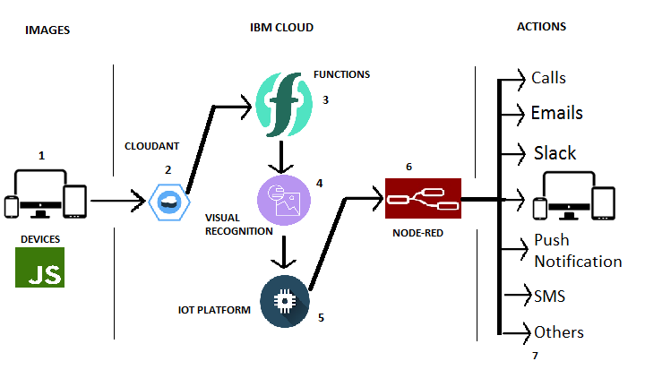
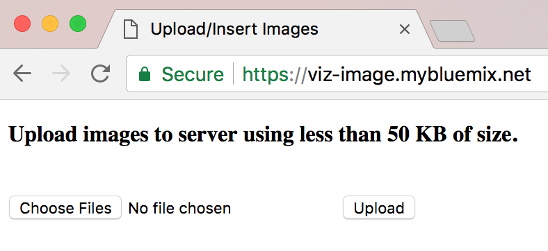
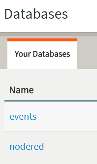
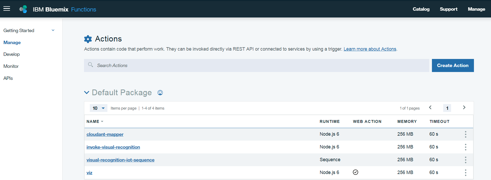
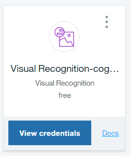
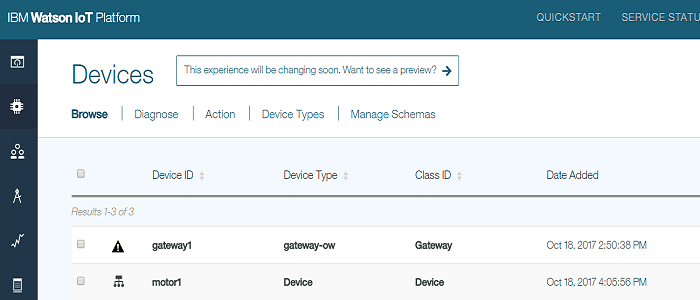
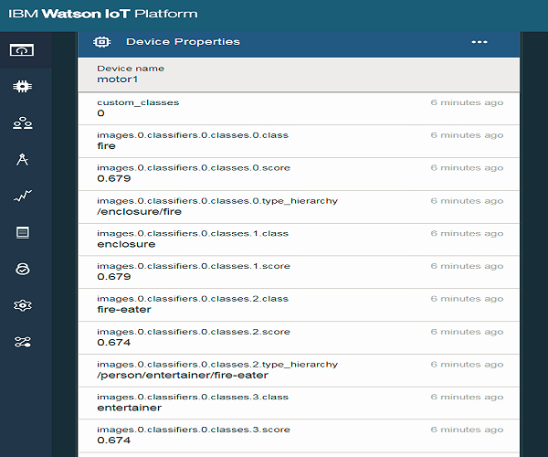
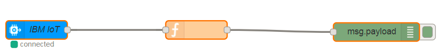
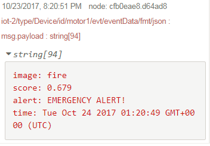

# Upload and process an image into IBM Cloud to receive alerts
Build an IoT project with IBM Cloud Functions (serverless), Node-RED, Node.js and along with IoT Platform.


## Overview and Goal
The goal of this tutorial is to take images from any other source, process it and trigger alerts to inform a change, a danger, etc. This project can be a quick setup and can be attached to an existing project to do the analysis of images and send alerts.

This tutorial will use an app to insert images into Cloudant, process it and display an alert. It will be divided into parts followed by steps in each part to help you build an application based on visual recognition. The folders in this repo are seperate entities of applications that will need a separate setup.

The workflow is not limited to the diagram shown above only but it can be expanded. We will be showcasing how to do it and you can take on this project and expand it, change it or make a real use of it.

Let's take a look on these parts:
* Run any application to upload an image. In this example, I provided the **viz-send-image-app** folder.
* Create a Cloudant database service
* Create IBM Cloud Functions (**viz-openwhisk** folder)
* Include Watson Visual Recognition code in IBM Cloud Functions
* Create IoT Platform service where IBM Cloud Functions will process images and send them to the IoT Platform
* Create Node-RED nodes to send the any alert

## Prerequisites
You will need the following accounts and tools:
* [Bluemix account](https://console.ng.bluemix.net/registration/)
* [Bluemix CLI](https://console.bluemix.net/docs/cli/reference/bluemix_cli/index.html#getting-started)
* [nodejs](https://nodejs.org/en/download/)
To verify you have nodejs installed run `node -v` at a command prompt/terminal.
* Optional: [Git](https://git-scm.com/downloads)
If you choose to use Git to download the code samples you must also have a [GitHub.com account](https://github.com). You can also download the code as a compressed file without a GitHub.com account.


## Deploy to Bluemix
In this tutorial, you will require to setup each folder as a separate applications on IBM Cloud. 

There will manual setups from terminal, basically running command lines. The "Deploy to Bluemix" button for easy deployments is under work.


## Steps
As the diagram above in the picture presents six steps. It will be best to start as the following:
* **viz-send-image-app** folder can be executed locally or be pushed to the cloud if you want
* Create a Node-RED package that includes Cloudant, IoT Platform and Visual Recognition services
* Create IBM Cloud Functions from the Catalog
* Copy/Paste your credentials from Cloudant, IoT Platform, Visual Recognition into credentials.cfg (in **viz-openwhisk-functions**) and credentials.json (in **viz-send-image-app**)
* Copy/Paste the json flow in your Node-RED editor
* Make sure that ibmiot in Node-RED have the correct information of IoT Platform

> We will dive more into the details of each part in the next steps assuming that you have your Bluemix account set for use. We will not complicate building these applications, so we will be relying on the manual creation of these setups from Bluemix browser and minimizing the command lines. More command lines are used when setting up Openwhisk.

**__IMPORTANT__: Make sure before you start with the steps, you update the files to match your credentials and rename your apps names.**

## Step 1 - App UI
We have a basic UI at **viz-send-image-app** to help us upload images into Cloudant database.



**Update with your credentials in credentials.json and rename app name in manifest.yml**

**To deploy this setup from a terminal, use the following commands (make sure CLIs are downloaded for these commands):**
```
bx api api.ng.bluemix.net
bx login -u <YOUR_BLUEMIX_USERNAME>
bx target -o <ORG> -s <SPACE>
bx push <APP_NAME> --no-start
bx restage <APP_NAME>
bx start <APP_NAME>
```
> To troubleshoot errors, use `bx logs YOUR_APP_NAME --recent` command (i.e. `bx logs viz-image --recent`).

* In a browser, access your app by:  
Typing your app's URL: `https://YOUR_APP_NAME.mybluemix.net` (YOUR_APP_NAME = whatever you named your app)  
> For example, my app's url is as the following: `https://viz-image.mybluemix.net/`.


## Step 2 - Cloudant database


Create a database to store the incoming images. Go to IBM Cloud's (Bluemix) Catalog and look for Cloudant database. Create a service with a name or your choice. Then save its credentials for a later use. Launch Cloudant db and create a database and name it. I used created a db, for example, that I called it events.


## Step 3 - IBM Cloud Functions (previously OpenWhisk)

> **Add your credentials to credentials.env.example and rename it to credentials.env**

> **Make sure you rename app and service names to your specific app and service names in:**
>  **- credentials.env.example**
>  **- mac-ubuntu-linux.sh**
>  **- windows.bat**

For Mac users (mac-ubuntu-linux.sh is for Linux based OS):
```
$ cd viz-send-image-app
$ ./mac-ubuntu-linux.sh --install

```
For windows users:
```
$ cd viz-send-image-app
$ windows.bat --install

```
> If you decided to remove what you've installed, replace --install with --uninstall and run the command.

> Make sure you are able to run files locally like *.sh or *.bat


## Step 4 - Visual Recognition
No action is required from the users side. To explain it, actually, IBM Cloud Functions will grab the image inserted to Cloudant DB and analyze it by Watson Visual Recognition that we have pushed in step 3. Then it posts an event to the Watson IoT Platform for further processing.


* First upload will be registered as a device to the Watson IoT Platform.
* Go the Watson IoT Platform and check for the processed image data as an event stored in the Cloudant DB.


## Step 5 - Watson IoT Platform
You will need to create a [gateway](https://developer.ibm.com/recipes/tutorials/how-to-register-gateways-in-ibm-watson-iot-platform/) and a [device](https://developer.ibm.com/recipes/tutorials/how-to-register-devices-in-ibm-iot-foundation/) manually in the IoT platform. They will be auto-registered when data will flow from IBM Functions the first time.




## Step 6 - Node-RED
Copy and paste the json flow from **viz-node-red/flow.json** into Import -> Clipboard at your Node-RED `https://YOUR_APP_NAME.mybluemix.net/red` (YOUR_APP_NAME = whatever you named your app). Assuming that you already created Node-RED package from IBM Cloud's Catalog. If not, go ahead and create one. Ususally with Node-RED package, you'll get a Cloudant db. You can either use that or bind the one you created in Step 2. To avoid confusion, make sure you use one Cloudant service.




## Useful links

* [IBM Bluemix](https://bluemix.net/)  
* [IBM Bluemix Documentation](https://www.ng.bluemix.net/docs/)  
* [IBM Bluemix Developers Community](http://developer.ibm.com/bluemix)  
* [IBM Watson Internet of Things](http://www.ibm.com/internet-of-things/)  
* [IBM Watson IoT Platform](http://www.ibm.com/internet-of-things/iot-solutions/watson-iot-platform/)   
* [IBM Watson IoT Platform Developers Community](https://developer.ibm.com/iotplatform/)
* [Simulate IoT Device](https://github.com/IBM/manage-control-device-node-red)


## Privacy notice
This web application includes code to track deployments to [IBM Bluemix](https://www.bluemix.net/) and other Cloud Foundry platforms. The following information is sent to a [Deployment Tracker](https://github.com/IBM/metrics-collector-service) service on each deployment:

* Node.js package version
* Node.js repository URL
* Cloudant database
* Watson visual recognition service
* Application Name (`application_name`)
* Application GUID (`application_id`)
* Application instance index number (`instance_index`)
* Space ID (`space_id`)
* Application Version (`application_version`)
* Application URIs (`application_uris`)
* Node-RED package version
* Labels of bound services
* Number of instances for each bound service and associated plan information
* Metadata in the repository.yaml file

This data is collected from the `package.json` and `repository.yaml` file in the sample application and the `VCAP_APPLICATION` and `VCAP_SERVICES` environment variables in IBM Bluemix and other Cloud Foundry platforms. This data is used by IBM to track metrics around deployments of sample applications to IBM Bluemix to measure the usefulness of our examples, so that we can continuously improve the content we offer to you. Only deployments of sample applications that include code to ping the Deployment Tracker service will be tracked.

## Disabling deployment tracking
Deployment tracking can be disabled by removing the `require("metrics-tracker-client").track();` line from the './bin/www' file.

## License
[Apache 2.0](LICENSE)
